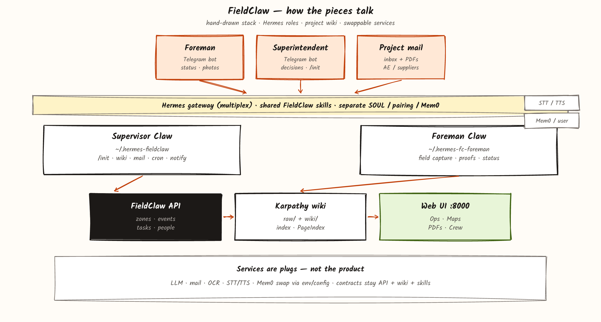

# FieldClaw

**Ground truth in. Decisions out.**

FieldClaw is the on-site brain for a construction job. Foremen report from Telegram, mail and PDFs land in a project knowledge base, and the superintendent gets a live ops picture — zones, shortages, log, wiki — with answers that can go back to the field. It runs on [Hermes](https://github.com/NousResearch/hermes-agent) plus a small FieldClaw API and web UI.

Pitch deck: [`deck/FieldClaw_Pitch_Deck.pdf`](deck/FieldClaw_Pitch_Deck.pdf)  
Hermes install notes: [`deploy/hermes/README.md`](deploy/hermes/README.md)

---

## Architecture



Hand-drawn with the same **rough.js + Kalam** pipeline as the pitch deck (`deck/render-diagrams.mjs`). Regenerate with:

```bash
cd deck && node ../docs/diagrams/render-architecture.mjs
```

People and documents come in on the left (Telegram + mail). Hermes sits in the middle as two roles — Supervisor and Foreman — that share FieldClaw skills but keep separate bots, memories, and personalities. On the right, FieldClaw stores structured site state and a per-project markdown wiki the UI reads at `http://127.0.0.1:8000/`. The footer is intentional: LLM, mail, OCR, STT/TTS, and memory providers are plugs — swap them in env/config; the contracts that matter are the API, the wiki, and the skills.

---

## The knowledge base (Karpathy LLM wiki)

Site memory is not a vector database. It follows Andrej Karpathy’s **LLM wiki** idea: keep raw sources on disk, let the agent compile and maintain a real markdown wiki, and navigate with an index instead of embeddings.

Read the original pattern here: [llm-wiki.md (Karpathy gist)](https://gist.github.com/karpathy/442a6bf555914893e9891c11519de94f).

In FieldClaw that looks like this per project:

```
kb/projects/{project_id}/
  raw/     # originals: PDFs, extracts, attachments (don’t invent facts here)
  wiki/    # agent-maintained pages the UI and Hermes both read
    index.md
    ops/ zones/ people/ sources/ maps/ …
```

When a PDF or email attachment arrives, it goes into `raw/`, then Hermes (or the ingest API) updates wiki pages and `index.md`. To answer a question, the agent opens the index, follows `[[links]]`, and greps the tree — same workflow Karpathy describes, scoped to one construction site so jobs never mix.

Large PDFs also get a **PageIndex** tree (structure) plus OCR text (we use Datalab today; that’s replaceable). Folders are created during Supervisor **`/init`**, not hardcoded by the API, so each site can grow the taxonomy it actually needs.

---

## Features, step by step

### 1. Create a project and open the UI

Run `./scripts/start_fieldclaw.sh`, open `http://127.0.0.1:8000/`, and create a project in onboard. You can attach an existing mailbox address or let provisioning create one. **Reset cache** clears sticky browser project ids if you wiped the DB.

### 2. Pair Supervisor and Foreman

DM the superintendent bot → paste the pairing code in the UI. Foremen use a **different** bot (separate Hermes profile). People are stored as `superintendent` / `foreman` with their Telegram ids, so the API knows who can do what.

### 3. Bootstrap the site with `/init`

In Telegram, run **`/init`**. Supervisor scaffolds the wiki folders, pulls recent mail attachments, tries to import a site map, and reports what’s ready. This is the “from scratch” path so you don’t hand-build the KB.

### 4. Map the site (zones)

Import GeoJSON, or a site-plan PDF/PNG whose filename looks like `sitemap` / `site-plan` / `zone-map`, or ask the super for area names and `POST` zones. The Ops map and Wiki → **Maps** only count as live when the **API** has polygons — wiki pages alone don’t count.

### 5. Field reports from Telegram

Foreman texts (and optionally photos) a status, shortage, safety, or quality note. Hermes posts an event to FieldClaw, the API appends `wiki/ops/log.md`, the item shows on the super-queue, and Supervisor can notify the superintendent. Photos must be uploaded into `wiki/media/` (they’re not saved automatically from Telegram).

### 6. Mail and documents

Inbound project mail is polled into events + wiki ingest. PDFs show under Wiki → **PDFs & photos**; OCR outlines land under `sources/`. Multi-project setups route by inbox → project id (don’t trust a stale env project id).

### 7. Voice (optional)

Voice notes can go through STT; replies can use TTS. Today that’s wired for smallest.ai; point the same skill scripts at another provider if you prefer.

### 8. Cron / watchers

On the Supervisor profile: shortage escalation, supplier-delay checks, mail poll, daily report, supplier check-in. Skills encode the hard parts (dedup, which HTTP transport works where, don’t escalate the wrong project).

### 9. Multi-project

Many projects, each with its own `kb/projects/{id}/` and usually its own inbox. Skills list projects, match mail by inbox, and dedup threads by id so one shared inbox mistake doesn’t poison every job.

### 10. Demo corpus (Wilbarger)

For a real-looking demo we pulled public Wilbarger Creek RWWTF bid docs (Legistar/Granicus), split big PDFs for mail limits, built zone GeoJSON from the process areas, and seeded mail into a demo inbox. Notes: `kb/samples/wilbarger/SOURCES.md` and `kb/samples/sitemaps/wilbarger-rwwtf-zones.geojson`. Foreman “pulse” seeding stays opt-in.

---

## Quick start

```bash
./scripts/start_fieldclaw.sh
# UI → http://127.0.0.1:8000/
# logs → /tmp/fieldclaw/
```

API only: `cd apps/api && uv sync && uv run uvicorn fieldclaw_api.main:app --host 127.0.0.1 --port 8000`  
Full Hermes/Telegram setup: [`deploy/hermes/README.md`](deploy/hermes/README.md)

---

## Repo layout

| Path | What |
|------|------|
| `apps/api/` | Logbook API |
| `apps/web/` | Dashboard |
| `apps/hermes-skill/fieldclaw/` | Skills (`/init`, mail, sitemap, cron, …) |
| `deploy/hermes/` | Profiles, env example, provision script |
| `scripts/start_fieldclaw.sh` | API + gateway |
| `kb/samples/` | Demo GeoJSON + corpus index |
| `deck/` | Pitch PDF |
| `docs/diagrams/` | Architecture drawing (rough.js + Kalam, pitch-deck style) |

---

## Services (swappable)

These are the defaults we used while building. None of them are the product core — change providers in `.env` / Hermes config when you need to.

| Concern | Default in this repo | Notes |
|---------|----------------------|--------|
| Agent runtime | Hermes | Skills + gateway; keep the FieldClaw skill pack |
| Chat LLM | OpenRouter (or whatever Hermes is set to) | Drop-in via Hermes model config |
| Project email | AgentMail (`*.agentmail.to`) | Any mailbox API works if you adapt the poll skill |
| PDF / image OCR | Datalab (Chandra-class) | Swap the convert client; keep ingest contracts |
| Large-PDF structure | PageIndex | Optional; wiki still works without it |
| STT / TTS | smallest.ai | Optional; scripts under the skill tree |
| Personal memory | Mem0 (per Telegram user) | Don’t set a global `MEM0_USER_ID` |
| Structured store | SQLite via FastAPI | Can move DB URL later; API shape matters more |
| Transport | Telegram | Pairing + people table are the integration points |

FieldClaw’s stable surface is: **HTTP logbook**, **per-project wiki**, **role-aware Telegram skills**, and **honest notify/ingest**. Everything in the table above is plumbing.

---

## Honesty

Don’t log “notified” unless Telegram actually delivered. Don’t claim the wiki updated unless ingest succeeded. Don’t invent POs, zones, or people. Don’t discuss sim/replay on live site chats.
